# 🔥 Fire Writing Application - Detailed Flowchart & Code Explanation

## 📊 Complete Application Flow Diagram

```mermaid
flowchart TD
    Start([START APPLICATION]) --> Init[Initialize FireWritingApp]
    
    Init --> DownloadModel{Model File<br/>Exists?}
    DownloadModel -->|No| Download[Download MediaPipe<br/>Hand Landmark Model<br/>urllib.request]
    DownloadModel -->|Yes| ConfigMP[Configure MediaPipe<br/>HandLandmarker]
    Download --> ConfigMP
    
    ConfigMP --> InitObjects[Initialize Objects:<br/>- HeartEffect left<br/>- HeartEffect right<br/>- Particle list<br/>- Hand data stores]
    
    InitObjects --> InitCamera[Initialize Camera<br/>cv2.VideoCapture<br/>1280x720]
    
    InitCamera --> MainLoop{Main Loop<br/>While True}
    
    MainLoop -->|Frame Read| ReadFrame[Read Frame from Camera<br/>cv2.VideoCapture.read]
    
    ReadFrame --> FlipFrame[Flip Frame Horizontally<br/>cv2.flip for mirror view]
    
    FlipFrame --> ConvertRGB[Convert BGR to RGB<br/>cv2.cvtColor<br/>MediaPipe needs RGB]
    
    ConvertRGB --> CreateMPImage[Create mp.Image object<br/>with timestamp]
    
    CreateMPImage --> DetectHands[Detect Hands<br/>detector.detect_for_video<br/>MediaPipe HandLandmarker]
    
    DetectHands --> HandsFound{Hands<br/>Detected?}
    
    HandsFound -->|Yes| FirstPass[FIRST PASS:<br/>Collect Hand Data]
    HandsFound -->|No| SkipToRender[Skip to Rendering]
    
    FirstPass --> ExtractLandmarks[For Each Hand:<br/>Extract Landmarks<br/>get_hand_landmarks]
    
    ExtractLandmarks --> CalcPositions[Calculate:<br/>- Palm position<br/>- Index finger tip<br/>- Thumb tip<br/>- Hand size depth]
    
    CalcPositions --> StoreData[Store in hand_data:<br/>palm, index, thumb,<br/>hand_size]
    
    StoreData --> CheckHandType{Hand Type?}
    
    CheckHandType -->|Left| StoreLeft[Store in<br/>left_hand_data]
    CheckHandType -->|Right| StoreRight[Store in<br/>right_hand_data]
    
    StoreLeft --> CheckHeart[Check for Heart Gesture]
    StoreRight --> CheckHeart
    
    CheckHeart --> HeartGesture[detect_heart_gesture:<br/>Calculate distances between<br/>thumbs & index fingers]
    
    HeartGesture --> IsHeart{Heart Shape<br/>Formed?}
    
    IsHeart -->|Yes| ActivateHearts[Set heart_gesture_active = True<br/>Activate both hearts]
    IsHeart -->|No| KeepState[Keep current state]
    
    ActivateHearts --> CalcHeartSize[Calculate heart size based<br/>on hand_size depth]
    
    CalcHeartSize --> PositionHearts[Position hearts at<br/>left & right palm centers]
    
    PositionHearts --> UpdateHearts[If hearts active:<br/>Continuously update positions]
    KeepState --> UpdateHearts
    
    UpdateHearts --> SecondPass[SECOND PASS:<br/>Process Hand Actions]
    
    SecondPass --> CheckHeartActive{heart_gesture<br/>_active?}
    
    CheckHeartActive -->|No| CreateFire[Create Fire Particles<br/>at palm positions]
    CheckHeartActive -->|Yes| SkipFire[Skip Fire Creation]
    
    CreateFire --> FireParticles[FireParticle objects:<br/>- Random velocity<br/>- Upward motion<br/>- Life cycles<br/>- Color gradients]
    
    FireParticles --> UpdatePart[Update Particles]
    SkipFire --> UpdatePart
    
    UpdatePart --> ParticlePhysics[For each particle:<br/>- Update position x,y<br/>- Apply gravity vy-=0.3<br/>- Add randomness<br/>- Decrease life<br/>- Remove if dead]
    
    ParticlePhysics --> DrawParticles[Draw Particles<br/>draw_particles]
    
    DrawParticles --> CreateOverlay[Create overlay frame<br/>numpy zeros_like]
    
    CreateOverlay --> DrawFireLoop[For each particle:<br/>Draw circles]
    
    DrawFireLoop --> AddYellowOutline[Red Fire Only:<br/>Add yellow outline<br/>Add yellow core]
    
    AddYellowOutline --> ApplyBlur[Apply Gaussian Blur<br/>cv2.GaussianBlur<br/>for glow effect]
    
    ApplyBlur --> BlendFrames[Blend overlay with frame<br/>numpy alpha blending]
    
    BlendFrames --> AddTexture[Add black texture lines<br/>on larger particles<br/>cv2.line]
    
    AddTexture --> UpdateHeartEffects[Update Heart Effects<br/>left_heart.update<br/>right_heart.update]
    
    UpdateHeartEffects --> HeartPhysics[For each heart:<br/>Update dot positions]
    
    HeartPhysics --> CalcHeartPerimeter[Calculate dots on<br/>heart perimeter<br/>Parametric equations]
    
    CalcHeartPerimeter --> MoveDots[Move dots outward<br/>from perimeter]
    
    MoveDots --> ResetDots[Reset dots when<br/>distance > max_distance]
    
    ResetDots --> DrawHearts[Draw Hearts<br/>left_heart.draw<br/>right_heart.draw]
    
    DrawHearts --> HeartShape[Draw heart shape using<br/>parametric equations:<br/>x = 16sin³t<br/>y = 13cost - 5cos2t<br/>- 2cos3t - cos4t]
    
    HeartShape --> HeartLayers[Draw multiple layers:<br/>- Outer glow thick<br/>- Middle glow medium<br/>- Core bright thin]
    
    HeartLayers --> DrawDots[Draw white & purple dots<br/>with fade effect]
    
    DrawDots --> AddInstructions[Add text instructions<br/>cv2.putText]
    
    AddInstructions --> DisplayFrame[Display Frame<br/>cv2.imshow]
    
    DisplayFrame --> WaitKey[Wait for key press<br/>cv2.waitKey 1ms]
    
    WaitKey --> CheckKey{Key Pressed?}
    
    CheckKey -->|'q'| Cleanup[Cleanup & Exit]
    CheckKey -->|'c'| ClearHearts[Clear hearts<br/>Resume fire<br/>heart_gesture_active=False]
    CheckKey -->|None| MainLoop
    
    ClearHearts --> MainLoop
    SkipToRender --> UpdatePart
    
    Cleanup --> ReleaseCamera[Release camera<br/>cv2.VideoCapture.release]
    ReleaseCamera --> DestroyWindows[Destroy windows<br/>cv2.destroyAllWindows]
    DestroyWindows --> CloseDetector[Close detector<br/>detector.close]
    CloseDetector --> End([END])
    
    style Start fill:#90EE90
    style End fill:#FFB6C1
    style DetectHands fill:#87CEEB
    style CreateFire fill:#FF6347
    style DrawHearts fill:#FF69B4
    style HeartGesture fill:#DDA0DD
    style ParticlePhysics fill:#FFA500
    style ApplyBlur fill:#FFD700
```



## 🔑 Key Components & Libraries Explanation

### 1️⃣ **MediaPipe (Hand Tracking)**
```python
from mediapipe.tasks import python
from mediapipe.tasks.python import vision
```

**Purpose:** Real-time hand landmark detection
- **HandLandmarker**: Detects up to 2 hands simultaneously
- Returns 21 landmarks per hand (finger tips, joints, palm points)
- **RunningMode.VIDEO**: Optimized for video processing with timestamps
- Processes at ~30 FPS for smooth tracking

**Key Operations:**
- `detect_for_video()`: Detects hands in video frame
- Returns: hand_landmarks (21 points) + handedness (Left/Right)

---

### 2️⃣ **OpenCV (Computer Vision & Rendering)**
```python
import cv2
```

**Purpose:** Camera access, image processing, and rendering

**Key Functions Used:**
- `VideoCapture(0)`: Access webcam
- `flip()`: Mirror frame horizontally
- `cvtColor()`: BGR ↔ RGB conversion
- `circle()`: Draw fire particles and dots
- `polylines()`: Draw heart shapes
- `GaussianBlur()`: Create glow effects
- `addWeighted()`: Blend layers for transparency
- `line()`: Draw texture lines
- `putText()`: Display instructions
- `LINE_AA`: Anti-aliasing flag for smooth edges

---

### 3️⃣ **NumPy (Numerical Computing)**
```python
import numpy as np
```

**Purpose:** Fast array operations and mathematical calculations

**Key Uses:**
- `zeros_like()`: Create blank overlay frames
- `linspace()`: Generate heart shape points
- Array operations: Alpha blending, color mixing
- Float/uint8 conversions for image manipulation
- Parametric equations for heart shape

---

### 4️⃣ **Particle System (Fire Effects)**

**FireParticle Class:**
```python
class FireParticle:
    - Position (x, y)
    - Velocity (vx, vy) - upward motion
    - Life cycle (15-30 frames)
    - Size (15-35 pixels)
    - Color type (red/white)
```

**Physics Simulation:**
1. **Initialization**: Random velocity upward
2. **Update**: 
   - Move particle: `x += vx`, `y += vy`
   - Apply gravity: `vy -= 0.3`
   - Add randomness: `vx += random`
   - Decrease life: `life -= 1`
3. **Color Transitions**:
   - **Red Fire**: Yellow → Bright Red → Dark Red
   - **White Fire**: Bright White → Warm White → Cool White
4. **Rendering**:
   - Draw filled circles
   - Add yellow outlines (red fire only)
   - Add yellow cores
   - Apply Gaussian blur for glow
   - Add black texture lines

---

### 5️⃣ **Heart Effects System**

**HeartEffect Class:**
```python
class HeartEffect:
    - Position tracking
    - Dynamic size scaling
    - Dot particle system (40 dots)
```

**Heart Shape (Parametric Equations):**
```
x = 16 × sin³(t)
y = -(13cos(t) - 5cos(2t) - 2cos(3t) - cos(4t))
where t ∈ [0, 2π]
```

**Dot Physics:**
1. **Spawn**: On heart perimeter
2. **Move**: Outward along normal direction
3. **Fade**: Alpha decreases with distance
4. **Reset**: When distance > max_distance

**Rendering Layers:**
1. **Outer glow** (thick, transparent) - pink
2. **Middle glow** (medium) - magenta
3. **Core line** (thin, bright) - bright pink
4. **Animated dots** (white & purple)

---

## 🎯 Critical Algorithms

### **Heart Gesture Detection**
```python
def detect_heart_gesture():
    1. Calculate thumb-to-thumb distance
    2. Calculate index-to-index distance
    3. Calculate hand-to-hand distance
    4. Return True if:
       - Thumbs close (< 60 pixels)
       - Index fingers close (< 60 pixels)
       - Hands apart (100-300 pixels)
```

### **Depth Estimation**
```python
def calculate_heart_size(hand_size):
    1. Measure hand size in pixels
       (wrist to middle finger tip)
    2. Larger hand = closer to camera
    3. Scale factor = hand_size / 120
    4. Heart size = base_size × scale_factor
```

### **Particle Blending**
```python
1. Create overlay (blank frame)
2. Draw all particles on overlay
3. Apply Gaussian blur
4. Alpha blend:
   result = overlay × alpha + frame × (1-alpha)
```

---

## 🎨 Rendering Pipeline

### **Order of Operations (Each Frame):**

1. **Read & Prepare Frame**
   - Capture from camera
   - Flip horizontally (mirror)
   - Convert BGR → RGB

2. **Hand Detection**
   - MediaPipe processes frame
   - Extract 21 landmarks per hand
   - Determine Left/Right

3. **Data Collection**
   - Calculate palm positions
   - Calculate finger tips
   - Estimate hand size (depth)

4. **Gesture Recognition**
   - Check heart gesture
   - Set flags accordingly

5. **Particle Creation**
   - If no heart: Create fire particles
   - If heart active: Skip particles

6. **Particle Update & Physics**
   - Update all particles
   - Remove dead particles

7. **Particle Rendering**
   - Draw on overlay
   - Add effects (outlines, cores)
   - Apply blur
   - Blend with frame

8. **Heart Update & Rendering**
   - Update heart positions
   - Update dot positions
   - Draw heart shapes
   - Draw animated dots

9. **Display**
   - Add text instructions
   - Show final frame

---

## ⚙️ Performance Optimization

1. **Video Mode**: MediaPipe VIDEO mode for temporal stability
2. **Efficient Filtering**: List comprehension for dead particle removal
3. **Batch Rendering**: All particles drawn at once before blur
4. **Minimal State**: Only essential data stored
5. **Frame Rate Control**: 33ms timestamps (~30 FPS)

---

## 🔄 State Management

**Application States:**
```
1. Normal Mode:
   - Fire visible on both palms
   - Hearts inactive
   - heart_gesture_active = False

2. Heart Mode:
   - Fire stopped
   - Hearts active and tracking
   - heart_gesture_active = True

3. Transition:
   - 'c' key pressed
   - Hearts deactivated
   - Returns to Normal Mode
```

---

## 📈 Data Flow Summary

```
Camera Frame → MediaPipe → Hand Landmarks → 
Hand Data → Gesture Detection → State Update → 
Fire/Heart Creation → Physics Update → 
Rendering (Particles/Hearts) → Display
```

---

This flowchart and explanation cover the complete application architecture! 🎉
